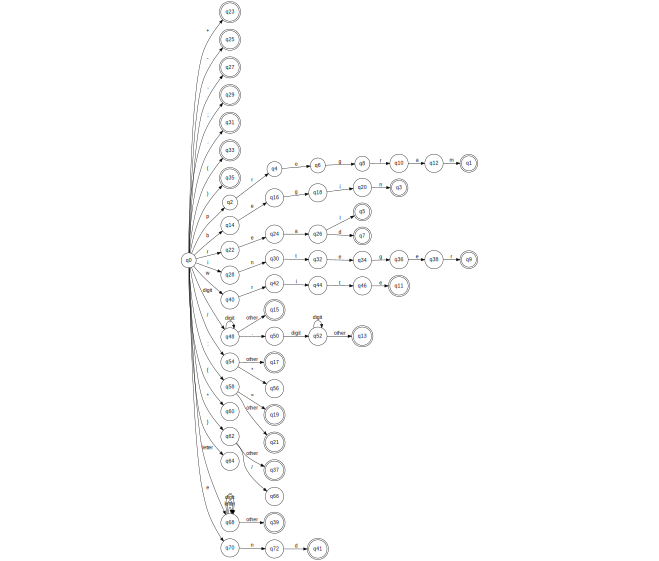

<h1 align="center">Compiler of simple arithmetic operations</h1>

This repository contains the final project of Compilers II subject at UFMT proposed by the professor <a href="https://github.com/thesivis">Raphael</a>.

The valid tokens of the language can be seen according to the following automata.

<p align="center">
  
</p>

Using the ascendent syntatic, the automata which describes the rules for the <a href="https://github.com/SousaPedroso/compiler/blob/main/language">language </a> is demonstrated below, using a dictionary in python:

<p align="center">
  
</p>


None external package was used for this project, but for execute it you must install this repository as a package due to the directories organization, running the following command on the root of this repository:

```
python -m pip install .
```

You can execute the programs through the <a href="./hm/HipoMaq.py">HipoMaq </a> which compiles and interprets text files like the examples on <a href="./tests">tests directory </a> passing two arguments: `source_code` with the relative or absolute path to compile the file and `dest_code` with the target absolute or relative path to save the object code. The commands below shows a example:

```
cd hm
```

```
python HipoMaq.py ..\tests\ex01 ..\compiled
```